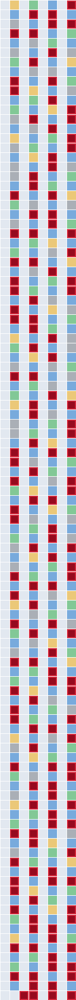
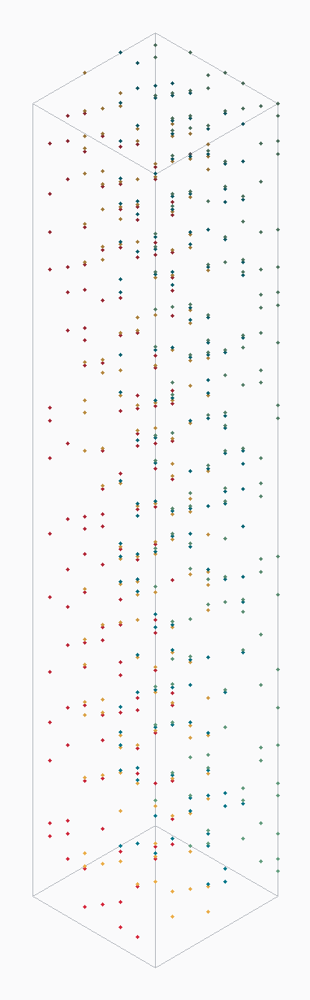
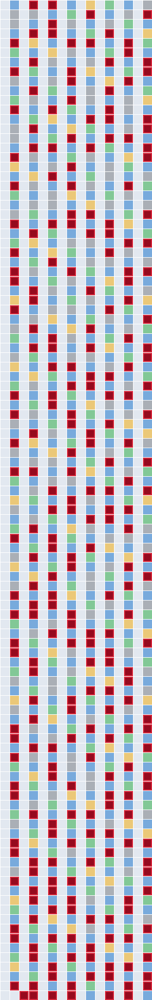
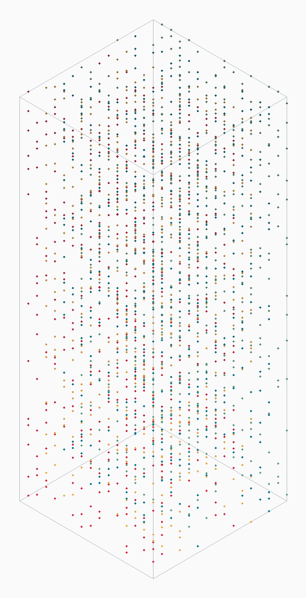
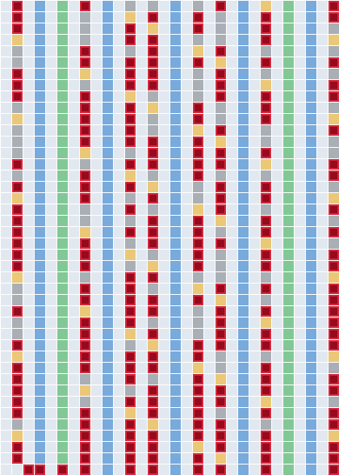

# Lifting the wheel into 3D — primes as defects in a periodic crystal

> **The question.** Don't just mark where primes land on a plane — extend into a third
> axis where **z is the order of magnitude**. Write the digit `0…b−1` along one axis,
> mark a point where a number is prime, climb the z-axis into the next block. Colour in
> the 3D point cloud of primes — first octal, then hex — and ask: **what structures
> appear, and is there a repeating pattern?**
>
> **The short answer.** Yes — but the repeating pattern belongs to the *composites*, not
> the primes. The non-primes form a perfectly **periodic crystal** of intersecting
> lattices (one flat set of planes per small prime), and **the primes are exactly the
> vacancies left in that crystal.** The vacancies inherit the crystal's symmetry — they
> live only in the "corridor" planes and tilt slightly (Chebyshev) — but they never
> settle into a repeating cell of their own. Octal → hex changes nothing structural: it
> is the **same ×2 refinement** as the flat wheel (planes double, every lattice slope
> doubles mod p). A **primorial** base (30) makes the crystal snap into a clean
> rectangular tile; powers of two can only ever shear it.

Reproduce: `python3 tools/lattice3d.py 16384` (or `make lattice`). All slope and
periodicity claims below are checked in code, not asserted.

---

## 1. The construction

**Raster view (the literal brief).** Lay the last digit across, the magnitude up:

```
x = n mod b           (the digit 0 … b−1, one column each)
z = floor(n / b)      (row; climbing one row = the next block of b = "next order of magnitude")
cell at (x, z) is coloured by what kills n: ÷2 ÷3 ÷5 ÷7, a bigger-factor composite, or PRIME
```

**3D point-cloud view (bijective digit coordinates).** Give magnitude its own axis:

```
X = n mod b           (units digit, 0 … b−1)
Y = (n / b) mod b     (next digit, 0 … b−1)
Z = n / b²            (everything above — the order of magnitude)
```

Every integer is one voxel; light it if `n` is prime. Exported as
[`cloud-octal.ply`](cloud-octal.ply) / [`cloud-hex.ply`](cloud-hex.ply) — open in
MeshLab/Blender and spin them. Isometric previews below.

---

## 2. Octal: corridors become planes, divisibility becomes diagonals


&nbsp;&nbsp;

*Left: the raster (8 columns, magnitude climbing). Right: the 3D prime cloud
(8×8 base, primes ≤ 4096, coloured by octal corridor).*

Two structures jump out, and both are **exactly periodic**:

- **Forbidden planes.** Columns `0,2,4,6` (even digit) are uniformly pale — *no prime
  ever lands there*. Half the columns are empty stripes; in 3D these are empty vertical
  planes that persist at every height. This is the mod-2 wheel, now extruded.
- **Divisibility diagonals.** For each odd prime `p`, the cells divisible by `p` satisfy
  `n = 8z + x ≡ 0 (mod p)`, i.e. **`x ≡ s·z (mod p)` with slope `s = (−8) mod p`.**
  Measured: `÷3` slope **1**, `÷5` slope **2**, `÷7` slope **6**. Each is a diagonal
  lattice with vertical period `p` (the blue/green/amber threads in the raster).

**The primes (red) are what's left** after every diagonal sweeps through — the vacancies,
confined to the four corridor columns.

## 3. Hex: the same picture at twice the resolution


&nbsp;&nbsp;

- **Forbidden planes:** `0,2,…,14` — eight empty stripes (still exactly half).
- **Divisibility diagonals:** `÷3` slope **2**, `÷5` slope **4**, `÷7` slope **5**.

Same crystal, finer grid, same primes.

---

## 4. The delta: octal → hex is the same ×2, in 3D

Because `16 = 2·8`, the hex layout is the octal layout with **one more digit-bit
resolved**, and *every* structural feature simply doubles:

| feature | octal | hex | relation |
|---|---|---|---|
| forbidden planes | 4 | 8 | ×2 |
| corridors | 4 | 8 | ×2 |
| diagonal slopes (÷3,÷5,÷7) | (1, 2, 6) | (2, 4, 5) | **slope_hex = 2·slope_oct (mod p)** |

`2·(1,2,6) ≡ (2,4,5) mod (3,5,7)` — verified. The cloud holds the *same primes*; hex just
splits each octal corridor-plane into two and tilts each lattice to twice the slope. **No
new prime structure — only resolution.** Exactly the conclusion of the flat
octal-vs-hex wheel ([octal-vs-hex.md](octal-vs-hex.md)), now visible in three dimensions.

---

## 5. Is there a repeating pattern? Yes — for the crystal, never for the primes

The "smallest-factor-among-{2,3,5,7}" colouring is **exactly periodic with period 210**
in `n` (checked for all `n < 5000`). So the *scaffold* of non-primes is a genuine
repeating crystal — a stack of flat divisibility lattices intersecting at fixed angles.

But the tile only lands on clean row boundaries when the **width divides 210**:

| width | 210 / width | tiling |
|---:|---:|:--|
| 8 (octal) | 26.25 | **sheared** — no rectangular repeat |
| 16 (hex) | 13.125 | **sheared** |
| 30 (primorial 2·3·5) | 7.000 | **clean rectangular tile** |
| 210 (primorial 2·3·5·7) | 1.000 | clean — one row repeats forever |

This is the same fact from a new angle: **a power-of-2 width can't see 3, 5 or 7**, so it
can never align with their periods — the crystal is forced into diagonals/shear. Give the
width those primes as factors and it snaps flat. The control:



*Base 30. Now `÷3` and `÷5` are **vertical** stripes (30 is divisible by them), only `÷7`
stays diagonal, and the whole sieve-colouring repeats every **7 rows**. Eight clean
corridor columns; primes (red) sit only in those.*

**And the primes themselves?** They are the vacancies in this periodic crystal. They
inherit its symmetry — confined to the corridor planes, with the faint Chebyshev tilt —
but they are **not** periodic. If the red cells ever tiled, primality would have a finite
closed form; they don't, and it doesn't. That is the honest payoff:

> **The composites build a repeating crystal you can predict exactly. The primes are the
> holes in it — symmetry-constrained, beautifully non-random-looking, yet provably never
> repeating. Octal and hex show the same crystal at two zoom levels; only changing the
> base's prime factors (primorials) changes the crystal itself.**
