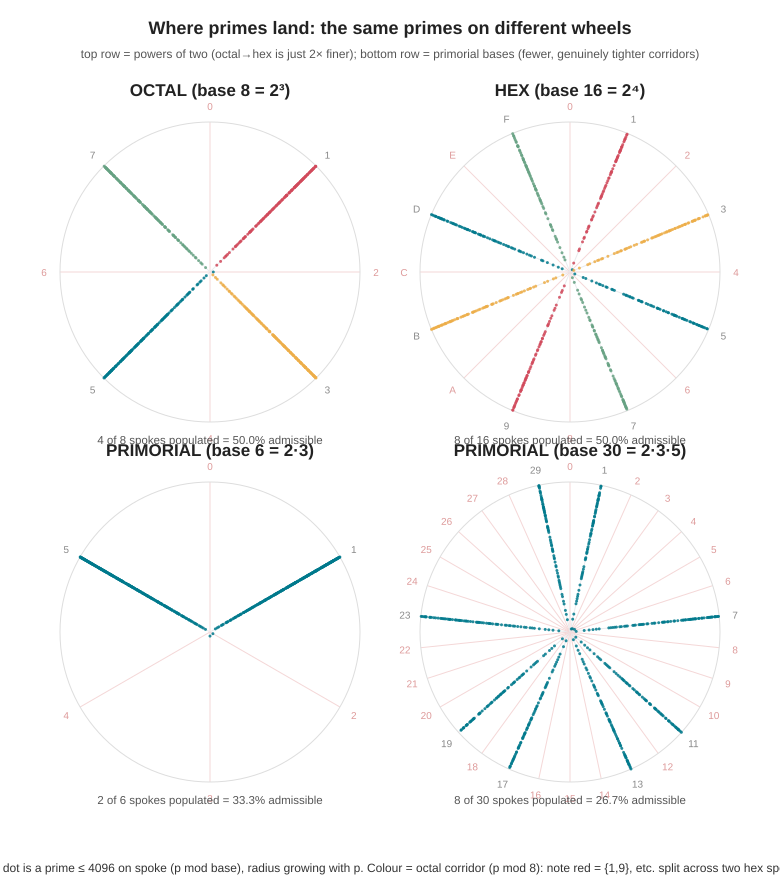
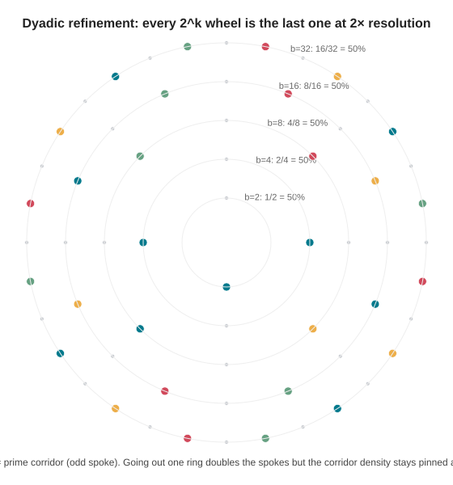
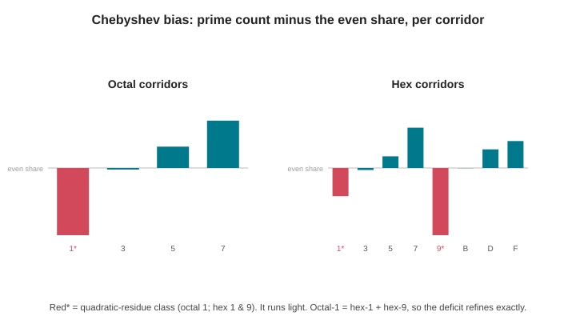

# The octal wheel vs the hex wheel — and what the delta tells us

> **The question.** Reduce primality to a "simpler number space." Find the geometric
> pattern of where primes sit in **octal (base 8)**, find it again in **hexadecimal
> (base 16)**, take the **delta**, and ask: *what could we see?*
>
> **The short answer.** There **is** a real geometric pattern, and it is the same object
> in both bases: a **modular wheel**. Primes are confined to the spokes coprime to the
> base — the "prime corridors." Octal shows 4 corridors; hex shows 8. But the
> octal→hex delta turns out to be **pure resolution**: the hex wheel is the octal wheel
> at 2× zoom, carrying exactly **one more bit** of each number and **no new prime
> information**. The reason is structural and is the real payoff of the experiment:
> *a base's last digit can only screen the primes that divide the base, and 8 and 16
> are both just powers of 2 — so both screen only the prime 2.* The geometry that
> actually tightens lives in **primorial bases** (6, 30, 210, …), which is precisely
> what this project's base-8 *multi-digit* predictor reconstructs.

All numbers below are measured, not asserted: a CPU sieve to **N = 10¹⁰**, giving
**π(N) = 455,052,511** (matches the published value exactly). Reproduce with
`make cpu && ./bin/cpu_survey 10000000000 && make figures`.

---

## 1. The geometry: a number sits on a wheel

Lay the integers around a circle with **b** spokes — a clock with `b` hours. The number
`n` lands on spoke `n mod b`. This is the only honest sense in which a *base* has a
"geometry of primes": the last digit **is** the spoke.

Now the one fact that does all the work:

> A prime `p > b` can only sit on a spoke `s` with **gcd(s, b) = 1**.
> If `p` shared a factor with the base, that factor would divide `p`.

Those coprime spokes are the **prime corridors**; the rest are **forbidden** and sit
empty forever (save the tiny primes that *generate* the wheel). The number of corridors
is Euler's totient **φ(b)**, so the **admissible density is φ(b)/b**.

*Each dot is a prime ≤ 4096, placed on spoke `p mod base`, radius growing with `p`. The
forbidden wedges are visibly empty. Colour = the prime's **octal** corridor (`p mod 8`).*

---

## 2. Octal: 4 corridors on every other spoke

Base 8 = 2³. A prime > 2 must be odd, so its last octal digit is odd:

| octal spoke | corprime to 8? | primes (N=10¹⁰) | share | note |
|---:|:---:|---:|---:|:--|
| 0,2,4,6 | no | 0 | 0.0000% | forbidden (even) |
| **1** | yes | 113,758,759 | 24.9990% | quadratic-residue class |
| **3** | yes | 113,763,027 | 25.0000% | corridor |
| **5** | yes | 113,764,516 | 25.0003% | corridor |
| **7** | yes | 113,766,208 | 25.0007% | corridor |

**φ(8)/8 = 4/8 = 50%.** Geometrically: four evenly-spaced rays 45° apart, every other
spoke empty. Within the corridors the primes are split ≈ evenly (Dirichlet's theorem),
with one subtle exception covered in §5.

## 3. Hex: 8 corridors — the same picture, twice as fine

Base 16 = 2⁴. Again "prime ⇒ odd," so the corridors are the 8 odd spokes
{1,3,5,7,9,B,D,F}, each carrying ≈ 12.5% of primes. **φ(16)/16 = 8/16 = 50%** — the
*identical* admissible density as octal. Eight evenly-spaced rays, 22.5° apart.

---

## 4. The delta: hex is octal at 2× resolution — and nothing more

Because 16 = 2·8, we have `n mod 8 = (n mod 16) mod 8`. The hex digit **determines** the
octal digit, so every octal corridor `d` **splits into exactly two** hex corridors,
`d` and `d+8`:

| octal `d` | primes | → hex `d` | hex `d+8` | low / high split |
|---:|---:|---:|---:|:--:|
| 1 | 113,758,759 | 56,880,273 | 56,878,486 | 50.001% / 49.999% |
| 3 | 113,763,027 | 56,881,472 | 56,881,555 | 50.000% / 50.000% |
| 5 | 113,764,516 | 56,882,100 | 56,882,416 | 50.000% / 50.000% |
| 7 | 113,766,208 | 56,883,409 | 56,882,799 | 50.000% / 50.000% |

The split is **50/50 to four decimals.** What is that extra hex digit actually telling
you? Exactly **one bit** — bit 3, the 8's-place bit of `n` — and that bit is statistically
independent of primality, so it just halves each corridor evenly.

This is the heart of the comparative analysis:

> **The octal→hex delta carries no new prime structure. It is one extra bit of the
> number, dealt out 50/50. The hex wheel is the octal wheel zoomed 2×.**

Iterate the zoom and you get the whole power-of-2 family — base 2 → 4 → 8 → 16 → 32 — a
**self-similar / dyadic** hierarchy. Each step doubles the spokes and reveals one more
low bit, yet the corridor density is **pinned at 50% forever**:

---

## 5. The one place octal and hex genuinely differ: the Chebyshev tilt

The corridors are not *perfectly* equal. The **quadratic-residue** class runs slightly
light (Chebyshev's bias — primes mildly avoid being squares mod `b`):

- **Octal:** every odd square is ≡ 1 (mod 8), so spoke **1** is the QR class. It trails
  its peers in every band (measured deficit at 10¹⁰: spoke 1 is the lightest corridor).
- **Hex:** odd squares are ≡ 1 or 9 (mod 16), so spokes **1 and 9** are the QR classes —
  and at 10¹⁰ they are precisely the two lightest hex corridors.

And here the delta says something exact and pretty: since octal-1 splits into hex-1 and
hex-9, **the single octal deficit refines into exactly the two hex deficits.** The bias
isn't destroyed by the zoom; it is resolved more finely.

Honesty check: this is a **sub-promille, slowly-fluctuating** effect. At N=10⁹ the hex
QR signal was muddy (spoke 1 lightest, but spoke 9 mid-pack); only by 10¹⁰ did {1,9}
settle in as the two lightest. It is a real, theorem-backed tendency — not a rule you can
bank on locally.

---

## 6. Why octal ≡ hex at the last digit — and what to use instead

Step back and the deep reason is one line:

> **A base's last digit only screens the primes that divide the base.**

`n mod 2^k` tells you `n mod 2` and `k−1` further bits — it constrains divisibility by
**2 and nothing else**, no matter how big `k` is. So every power-of-2 base gives the same
50% wheel:

| base `b` | factorization | φ(b)/b | primes screened by the last digit |
|---:|:--|---:|:--|
| 2 | 2 | 50.00% | 2 |
| 8 | 2³ | 50.00% | 2 *(only!)* |
| 16 | 2⁴ | 50.00% | 2 *(only!)* |
| 32 | 2⁵ | 50.00% | 2 *(only!)* |
| **10** | 2·5 | **40.00%** | 2, 5 |
| 6 | 2·3 | 33.33% | 2, 3 |
| 30 | 2·3·5 | 26.67% | 2, 3, 5 |
| 210 | 2·3·5·7 | 22.86% | 2, 3, 5, 7 |

Two things fall out:

1. **Octal and hex are informationally identical at the last digit** — both are "is `n`
   odd?" dressed up at different resolutions. Choosing hex over octal buys you a finer
   picture of the *same* prime, never a finer picture of *primality*.
2. The user's hunch that **base 10 is "strange"** is right, but it cuts the other way:
   10 = 2·5 screens **two** primes, so its 40% beats octal/hex's 50% despite being a
   "smaller" base. Selectivity tracks the base's *prime factors*, not its size.

The corridors that actually tighten belong to **primorial** bases 2, 6, 30, 210, 2310, …
(products of the first primes) — see the irregular, sparser wheels in the bottom row of
the rays figure. This is exactly the classical idea of **wheel factorization**.

### The tie-in to this project

The CUDA survey's "octal predictor" already lives this lesson. It does **not** rely on the
last octal digit (which screens only 2). It stacks **four** base-8 digit identities —

- last digit even ⇒ ÷2,
- alternating digit sum ≡ 0 (mod 3) ⇒ ÷3   *(since 8 ≡ −1 mod 3)*,
- digit sum ≡ 0 (mod 7) ⇒ ÷7   *(since 8 ≡ 1 mod 7)*,
- weighted digit sum ≡ 0 (mod 5) ⇒ ÷5,

— to reconstruct the **base-210 primorial wheel** (keeps 48/210 = 22.86%, a 4.375×
prime concentration) using nothing but octal digit arithmetic. The octal-vs-hex
comparison is the *why* behind that design: one power-of-2 digit is too weak; you must
re-introduce 3, 5, 7 through extra rules to get real geometric leverage.

---

## 7. So — what could we see?

- **A genuine geometry.** Primes live on the φ(b) coprime spokes of the `b`-wheel and
  nowhere else. The forbidden wedges are provably empty. That *is* a pattern, and it's
  the basis of every fast sieve.
- **The octal↔hex delta is scale, not signal.** Hex resolves each octal corridor into two
  equal halves on one extra bit. Same 50% density, same primes, finer grid. The
  power-of-2 family is self-similar; zooming reveals bits, not primes.
- **The only real octal-vs-hex difference is the Chebyshev tilt**, and the delta even
  predicts how it refines (octal-1 → hex-1 + hex-9). It is tiny and slow.
- **The lever is the base's prime factors, not the base's size.** Powers of 2 are the
  weakest possible wheels (they screen one prime); primorials are the strongest. This
  reframes the original theory: "reduce to a simpler number space" helps **only** if the
  base's factors line up with the primes you want to screen.
- **What we cannot see — and no base will show.** Inside the corridors the primes are
  Dirichlet-equidistributed and remain effectively pseudo-random. The wheel tells you
  with certainty where primes **cannot** be; it does **not** hand you the next prime.
  There is no closed-form "next prime" hiding in base 8 or 16 — only sharper odds.
