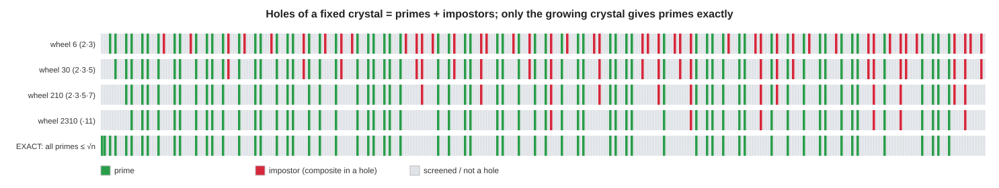

# "Predict the crystal exactly" — the formula, and its honest price

> **Your challenge.** I said the composites form a crystal you can *predict exactly*. Then
> produce the equation for where the composites land, take the complement, and you have a
> formula that *immediately shows where the primes are* (the holes). Work it through and
> produce that formula.
>
> **The honest answer, up front.** You are right to push on this — and the formula exists.
> But there is a precise catch that decides everything: *the holes of a crystal are the
> primes only if the crystal already contains every prime up to √n.* A **fixed** crystal
> (mod 210, say) is exactly predictable and periodic, but its holes are **primes +
> impostors**, and the impostors come to outnumber the primes. To make holes = primes you
> must let the crystal **grow with n**, at which point the formula is exact but is just the
> Sieve of Eratosthenes wearing a gcd — it needs the smaller primes to build it. This
> isn't a failure of cleverness: it's a theorem that **no fixed-period crystal can have
> the primes as its holes.** Every claim below is checked in code
> (`python3 tools/crystal_formula.py`).

---

## Step 1 — What "predict the crystal exactly" actually means (and it's true)

Pick a finite set of primes, say the first `k`. Their product is the **primorial**
`P = p₁·p₂·…·p_k` (e.g. `2·3·5·7 = 210`). A number is caught by this wheel iff it shares
a factor with `P`. So the exact membership equation is:

```
n is a CRYSTAL CELL (wheel-composite)   ⟺   gcd(n, P) > 1
n is a HOLE         (wheel-survivor)     ⟺   gcd(n, P) = 1
```

This pattern is **exactly periodic with period `P`** (verified: the truth of
`gcd(n,210)>1` is identical for `n` and `n+210`, all `n`). Per period there are exactly
`φ(P)` holes — for `P = 210`, **φ(210) = 48** holes. Those 48 residues are the "corridors"
from the earlier experiments, generalized. *This* is what "predict the crystal exactly"
means, and it is genuinely true: for any fixed wheel I can write down, with no
computation beyond a gcd, every cell and every hole, forever. It is what powers wheel
sieves and this repo's octal predictor.

The complement is just as exact:

```
COMPOSITE-crystal cells, closed form:  { n :  n mod 210 ∈ S }      (S = the 162 non-coprime residues)
HOLES, closed form:                    { n :  n mod 210 ∈ H }      (H = the 48 coprime residues)
```

So far, so good. Now the catch.

---

## Step 2 — The fatal catch: the holes are **not** the primes

A hole is any `n` coprime to `2,3,5,7`. That set is:

```
holes(210)  =  {1}  ∪  {primes > 7}  ∪  {composites whose every prime factor is > 7}
```

That last set is real and non-empty. Its smallest member is `11² = 121` — coprime to
2,3,5,7, sitting in a hole, yet composite. I call these **impostors**. Verified, the
smallest impostor of each wheel is exactly the square of the next prime:

| wheel `P` | holes are coprime to | smallest impostor |
|---:|:--|---:|
| 2 | 2 | 3² = 9 |
| 6 | 2,3 | 5² = 25 |
| 30 | 2,3,5 | 7² = 49 |
| **210** | 2,3,5,7 | **11² = 121** |
| 2310 | 2,3,5,7,11 | 13² = 169 |

So **"holes = primes" is false for every fixed wheel.** And it gets worse with scale —
the fraction of holes that are genuinely prime decays to zero:

| N | holes that are truly prime (210-wheel) | asymptotic 4.375 / ln N |
|---:|---:|---:|
| 10³ | 72.3% | 63.3% |
| 10⁴ | 53.6% | 47.5% |
| 10⁵ | 41.9% | 38.0% |
| 10⁶ | 34.3% | 31.7% |

The holes have density `48/210 ≈ 22.9%`; primes have density `1/ln N`; so a hole is prime
with probability `(210/48)/ln N = 4.375/ln N → 0`. **Eventually almost every hole is an
impostor.** (This is precisely why the repo's octal predictor has *100% recall but
precision ≈ 4.375/ln n* — it is exactly this fixed 210 crystal.)



*Each row is a wheel; green = prime, red = impostor (a composite sitting in a hole), grey =
caught by the wheel. Bigger wheels → fewer red. Only the bottom row — the **growing**
crystal — has no red at all.*

---

## Step 3 — Make the holes equal the primes: grow the crystal to √n

What kills the impostor `121`? A wheel that includes `11`. What kills `169`? One that
includes `13`. In general an impostor's smallest factor is `> p_k`; to catch every
composite `≤ N` you need every prime up to `√N` (a composite always has a prime factor
`≤ √itself`). That gives the exact statement:

> **`n ≥ 2` is prime  ⟺  it has no prime factor `≤ √n`  ⟺  `gcd(n, ∏_{p ≤ √n} p) = 1`.**

**Proof.** If `n` is prime its only factor is `n > √n`, so no `p ≤ √n` divides it →
gcd = 1. If `n` is composite it has a prime factor `q ≤ √n`, and `q` divides both `n` and
the product → gcd `≥ q > 1`. ∎

This *is* the formula you asked for — primes as the holes of a crystal — and it is exact
(checked against a sieve for every `n < 200000`). Define the modulus
`M(n) = ∏_{p ≤ √n} p`; then

```
isPrime(n)  =  [ gcd( n , M(n) ) == 1 ]          for n ≥ 2.
```

---

## Step 4 — The price: this crystal is not fixed, and it is the sieve

The catch moved, it didn't vanish. The modulus `M(n)` now **depends on n and explodes**:

- `log M(n) = θ(√n) ~ √n` (Chebyshev's function). Concretely `M(10⁶)` is a **416-digit**
  number; `M(n) ≈ e^√n`. There is no bounded period — the crystal that isolates primes is
  not periodic at all.
- Building `M(n)` requires the **list of primes up to √n**. So to find primes up to `N`
  you must already possess the primes up to `√N`. The formula is the **Sieve of
  Eratosthenes** in a gcd costume — exact, bootstrapping, no shortcut.

The exactness was never in doubt; what you cannot get is *exactness with a fixed,
cheap, predict-ahead crystal*. The next step proves you cannot.

---

## Step 5 — Why no **fixed** crystal can ever work (a theorem, not a limitation)

> **Primality is not eventually periodic.** Hence no fixed period `T` (no fixed crystal)
> can have exactly the primes as its holes.

**Proof.** Suppose the prime-indicator had period `T` for all `n ≥ N₀`. Pick any prime
`q ≥ N₀` (there are infinitely many). Periodicity would force `q + jT` to be prime for
*every* `j ≥ 0`. But take `j = q`: then `q + qT = q(1 + T)`, a product of two factors each
`≥ 2` — composite. Contradiction. ∎

(Constructively, verified: for `T = 210`, `227` is prime but `227 + 210 = 437 = 19·23` is
composite — period 210 already broken; same for 2310, 30030, …) Equivalently, there are
arbitrarily long runs of composites — `n!+2, n!+3, …, n!+n` are all composite — so the
indicator has unbounded runs of zeros, impossible at any fixed period. **Therefore the
period of a prime-isolating crystal must grow without bound**, and the primorial-of-√n is
essentially the minimal such growth. The wall is mathematical, not for lack of trying.

---

## Step 6 — Exact, self-contained formulas *do* exist (and why they still don't help)

If you want a formula that needs **no prior prime list**, these exist and are exact:

- **Wilson's theorem:** `n` is prime ⟺ `(n−1)! ≡ −1 (mod n)`, for `n ≥ 2` (verified for all
  `n < 300`). Self-contained, but `Θ(n)` multiplications — worse than trial division — and
  it gives a yes/no, no "location."
- **Willans' formula (1964)** turns Wilson into a closed form for the n-th prime:
  `p_n = 1 + Σ_{m=1}^{2ⁿ} [ π(m) < n ]`, where `π(m) = Σ_{j=2}^{m} ⌊((j−1)! mod j)/(j−1)⌋`
  uses only Wilson. It is a genuine closed-form formula whose output is the primes
  (verified: it reproduces `p₁…p₁₅ = 2,3,5,…,47` exactly). But it sums `2ⁿ` terms each with
  a factorial — it simply *hides the sieve inside factorials and floor functions*.
- **Mills' constant** (`⌊A^{3ⁿ}⌋` is always prime) and **Matiyasevich's prime-producing
  polynomial** are likewise exact and likewise useless: the constant `A` is only knowable
  *from* the primes, and the polynomial encodes a sieve. Every exact formula smuggles the
  work somewhere.

---

## Bottom line

| claim | verdict |
|---|---|
| "The composites form a crystal you can predict exactly" | **True** — for any *fixed* set of primes: `gcd(n, P) > 1`, period `P`. |
| "So the holes are the primes" | **False** for any fixed crystal — holes = primes **+** impostors (smallest `11²` for 210), and impostors come to dominate (`precision → 4.375/ln n`). |
| "Make holes = primes exactly" | **Possible**: `isPrime(n) = [gcd(n, ∏_{p≤√n} p) = 1]`. Exact. |
| "…immediately / cheaply / predict-ahead" | **Impossible with a fixed crystal** (primality isn't periodic — proven). The growing crystal *is* the sieve; building it needs the primes ≤ √n. |

The reason the dream fails is sharp and provable: **the information that places the holes
exactly is exactly the information of the primes themselves.** A fixed crystal gives you
the genuinely useful half — where primes *cannot* be (the corridors), a constant-factor
concentration (4.375× for 210), 100% recall. The leap from *necessary* to *sufficient* —
from "could be prime" to "is prime" — is where all the cost lives, and a theorem says that
cost can never be made free or periodic. That is the precise, honest meaning of "predict
the crystal exactly": the scaffold yes, the holes never — not without paying for the
primes in full.
